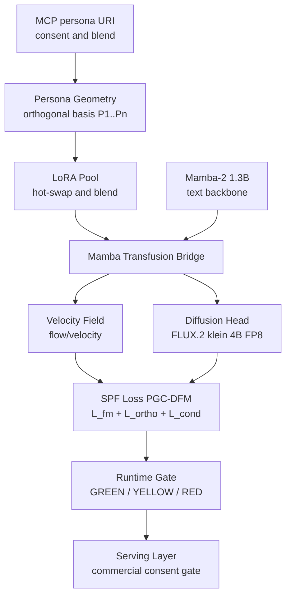

# klein-mamba-loa

**Stratified Persona Flow (SPF): disentangled velocity fields for multi-persona multimodal generation.**

A single-model research framework that routes multiple persona "strata" through a shared generative backbone — image generation via FLUX.2 klein 4B FP8, text via Mamba-2 1.3B — while keeping persona directions orthogonal in the velocity-field condition space. Pre-alpha; S0/S1 scaffold and S2 SPF Loss core are complete on CPU. S3/S4 training and evaluation require a GPU host.

License: MIT. Status: pre-alpha (`0.0.1.dev0`).

---

## What is this?

`klein-mamba-loa` explores a single hypothesis: multiple distinct "personas" can share one backbone and one velocity field if their condition vectors are kept **orthogonal** in the latent space. The project's full name references:

- **FLUX.2 klein** — the 4B FP8 image diffusion backbone
- **Mamba-2** — the 1.3B SSM text backbone
- **Loa** — an inspirational label for the LoRA hot-swap primitive (not a claim of literary equivalence to William Gibson's Sprawl trilogy; see disclaimer below)

The core loss function (`PGCDisentangledFMLoss`) is:

```
L = E_t[ || v_pred - v_target ||² ]                        # flow-matching term
  + lambda_ortho × Σ_{i<j} |⟨P_i, P_j⟩|²               # orthogonality penalty
  + lambda_cond  × CE(persona_id | ⟨pooled v_pred, P⟩)  # conditional id recovery
```

**This is not a validated result.** No empirical claims are made until S3 (3-run loss-curve study) and S4 (small-scale eval).

---

## Architecture



---

## Quickstart

```bash
# CPU-only core + tests (no torch download)
pip install -e ".[dev,mcp]"

# Full Tier 1 stack — needs a GPU host at runtime
pip install -e ".[flow,mamba,flux]"
```

### Verify structural integrity (CPU)

```bash
pytest tests/                  # all unit tests pass on CPU (no GPU required)
python scripts/measure_vram.py --tier 1   # returns DRY_RUN on CPU host
python scripts/license_guard.py           # verifies zero RED-license deps
```

### Toy training run (GPU, S3 gate)

```bash
# Requires: VRAM >= 24 GB (Tier 1), torch extras installed
python examples/toy_train.py
```

---

## Hardware tiers

| Tier | VRAM | Capabilities | Constraint |
|------|------|--------------|-----------|
| 0.5 | 16 GB | Inference only | Mamba-2 1.3B + FLUX.2 klein 4B FP8; no training; no Janus |
| 1 | 24 GB | Inference + LoRA training | Mamba-2 1.3B + FLUX.2 klein 4B FP8; Mamba and Janus mutually exclusive |
| 1.5 | 48 GB | Mamba + Janus simultaneous | Janus-Pro 1.5B co-resident with Mamba-2 1.3B |
| 2 | 80 GB+ | Full fine-tune | Planned; no wrappers implemented yet |

VRAM figures are estimates. Run `python scripts/measure_vram.py --tier <N>` on a GPU host for real measurements.

---

## Repository layout

```
klein_mamba_loa/
  core/           # tensor / dtype utilities (S2+)
  flow/
    velocity/     # placeholder (S3)
    loss/         # SPF Loss — pgc_dfm.py (LIVE, S2)
    solver/       # placeholder (S3)
  persona/
    geometry.py     # orthogonal persona basis (LIVE)
    lora_pool.py    # LoRA hot-swap surface (concrete at S2)
    disentangle.py  # angular_orthogonality metric (LIVE)
    erasure.py      # right-to-be-forgotten endpoint (LoRA-only at S1)
  backbone/
    mamba2_wrapper.py             # surface (concrete load at S2)
    flux2_klein_wrapper.py        # surface (concrete load at S2)
    janus_pro_wrapper.py          # surface (concrete load at S2)
    mamba_transfusion_bridge.py   # adapter surface (forward at S2)
  memory/         # Mem0 + LightRAG adapters (S2)
  mcp/            # persona:// resource scheme (0.1.0-draft, LIVE)
  serving/
    commercial_gate.py            # consent-blocked commercial path (LIVE)
  eval/
    runtime_gate.py               # GREEN/YELLOW/RED classifier (LIVE)
scripts/
  measure_vram.py        # VRAM stub (dry-run on CPU)
  license_guard.py       # RED-license refusal
  check_file_lengths.py  # 500-line file cap enforcement
docs/
  ARCHITECTURE.md
  MODEL_CARD.md
  REFERENCES.md          # arXiv citations (pending-human-verify)
  persona-rfc.md         # MCP persona:// RFC 0.1.0-draft
experiments/_wip/transfusion-gibson/
  pipeline-state.json    # current stage + gates
  CONTEXT.md             # narrative log
  TODO_NEXT.md           # top-3 next actions
  monitor_logs/          # audit-agent outputs (append-only)
  failures/              # R8 permanent failure parking
examples/
  toy_train.py           # S3 training scaffold (CPU-importable, GPU runnable)
tests/
USER_ACTIONS.sh          # all remaining manual steps in one script
```

---

## Development status

| Stage | Status | Notes |
|-------|--------|-------|
| S0-a (naming 4-axis) | GREEN | WebSearch verified |
| S0-b (FLUX.2 klein 4B FP8 weight path) | GREEN | MIT confirmed |
| S0-c (VRAM measurement) | DEFERRED to GPU host | dry-run returns `DRY_RUN` |
| S1 (scaffold + license guard) | GREEN | `THIRD_PARTY_NOTICES.md` + `scripts/license_guard.py` |
| S2 (SPF Loss core) | GREEN (CPU) | `flow/loss/pgc_dfm.py`, unit tests pass |
| S3 (toy 3-run training) | USER GATE (GPU) | `examples/toy_train.py` scaffold ready |
| S4 (small-scale eval) | USER GATE (GPU) | depends on S3; TIMETRAVEL branching probability + orthogonality metric |
| S5 (docs + release prep) | GREEN (CPU portion) | release tag is a user gate |

Live state: `experiments/_wip/transfusion-gibson/pipeline-state.json`.

---

## Ethics and consent

- **Right to be forgotten** is a default-on endpoint (`klein_mamba_loa/persona/erasure.py`). At S1 it removes the LoRA-pool directory `weights/lora_pool/<id>/`. Mem0/LightRAG cleanup lands at S2; `ErasurePlan.warnings` surfaces this gap explicitly.
- The MCP `persona://` resource scheme carries an explicit `consent` field. Missing `subject_consent_ref` for `real_person=true` or `deadbot=true` produces a `missing-consent` warning; `serving/commercial_gate.py` raises a hard `CommercialDeploymentBlocked` exception on the commercial path.
- **Deadbot (deceased-person persona) generation is not gated by code.** Operators are responsible for jurisdictional legal review.
- **Real-person personality cloning** requires explicit subject consent.

---

## License notes for upstream models

This repository ships **no model weights**. End users pull weights from upstream sources under their respective licenses; see `THIRD_PARTY_NOTICES.md` for the full dependency license map (GREEN / YELLOW / RED).

---

## Research references

Foundations (see `docs/REFERENCES.md` — arXiv IDs are `pending-human-verify` and MUST be opened in a browser before citing in any external publication; run `USER_ACTIONS.sh references-verify` to flip the flag):

- *Transfusion: Predict the Next Token and Diffuse Images with One Multi-Modal Model* (arXiv 2408.11039) [unverified]
- *The Geometry of Persona: Disentangling Personality from Reasoning in LLMs* (arXiv 2512.07092) [unverified]
- *Disentangled Representation Learning via Flow Matching* (arXiv 2602.05214) [unverified]

---

## Concept naming disclaimer

The repository name (`loa`) and several internal labels — "Persona-Geometry", "Stratified Persona Flow", "Loa hot-swap" — are **inspirational labels for technical primitives**, not claims of literary equivalence to William Gibson's Sprawl trilogy or to any other prior persona-vector formalism. The concept-to-technology mapping is many-to-many and wishful only at the framing level. In particular:

- A `PersonaVector` here is a learned condition direction, **not** Dixie Flatline (no persistent memory, no self-identity).
- LoRA hot-swap is **not** Loa possession in the literary sense (no agency transfer between substrates).
- "Stratified Persona Flow" deliberately differs from the prior arXiv 2602.15669 "Persona-Flow" (OCEAN trait vector algebra) — same word, different formalism (see `docs/REFERENCES.md`).

---

## Contributing

Pre-alpha. Issues and discussions only; PR queue opens at S2 milestone. Read `CONTRIBUTING.md` for the anti-checklist (no RED-license deps, no empirical claim before S3, no erasure removal).
